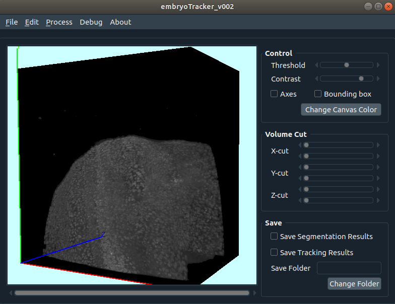

# MIVAQ: A unified cell tracking, visualization and annotation platform
MIVAQ (Microscopic Image Visualization, Annotation and Quantification) is an on-going project aiming to build a platform that supports 3D+time (colorful or gray) imaging data visualization, cell segmentation, cell tracking and results curation. It is built using Qt with C/C++ and OpenGL.

## Current interface and visualization quality

  

## Current segmentation quality

  

# Run the software
The software is still under development. The code was tested with Ubuntu 18.04.5 LTS and Ubuntu 16.04 LTS. The IDE and compiler are Qt creator with Qt v5.15.2 and GCC 5.3.1. Newer Linux, Qt, or GCC versions should also work.

To test the visualiztion, tracking and annotation functions:
1. Clone the project to your local hard drive.

<!-- 2. Download the 3rd-party vaa3d codes [here](https://drive.google.com/file/d/1OZO8f1_ia27ccgzRlfL-i-3oZzX5O8QP/view?usp=sharing) for tiff data loading. -->
2. Download the CINDA package for data association [here](https://github.com/yu-lab-vt/CINDA) and put it in the folder of celltracking.

3. Install OpenCV and Boost libraries to your system.

4. Use Qt to compile the code by opening the .pro file.

5. A sample data and analysis results can be found [here](https://drive.google.com/file/d/1h4X6FDUYXzntEM5IVhjifqZODHooDw6E/view?usp=sharing). Run the software, click File->Import image stack.... From the prompt window, select any tif file in the sample data and then enjoy.

<!-- Here are the specs of the PC currently for software development for reference: CPU i5-6600 CPU @ 3.30GHz; Mem 48GB; GPU GeForce GTX 1050 Ti; Hard drive 2T SSD. -->

# Other resources
[synQuant](https://github.com/yu-lab-vt/SynQuant), [muSSP](https://github.com/yu-lab-vt/muSSP), [CINDA](https://github.com/yu-lab-vt/CINDA), [Vaa3d project.](https://github.com/Vaa3D), [RayCasting volume rendering](https://martinopilia.com/posts/2018/09/17/volume-raycasting.html) and [QDarkStyleSheet.](https://github.com/ColinDuquesnoy/QDarkStyleSheet)

# Reference

[1] Congchao Wang, Yizhi Wang, Guoqiang Yu, Efficient Global Multi-object Tracking Under Minimum-cost Circulation Framework, arXiv:1911.00796. (accepted by IEEE Trans. on PAMI)

[2] Congchao Wang, Yizhi Wang, Yinxue Wang, Chiung-Ting Wu, Guoqiang Yu. (2019). muSSP: Efficient min-cost flow algorithm for multi-object tracking. In Advances in Neural Information Processing Systems (pp. 425-434).

[3] Yizhi Wang*, Congchao Wang*, Petter Ranefall, Gerard Joey Broussard, Yinxue Wang, Guilai Shi, Boyu Lyu, Chiung-Ting Wu, Yue Wang, Lin Tian, Guoqiang Yu. (2020). SynQuant: An Automatic Tool to Quantify Synapses from Microscopy Images, Bioinformatics, 36(5), 1599–1606.

[4] Peng, H., Ruan, Z., Long, F., Simpson, J.H., and Myers, E.W. (2010) “V3D enables real-time 3D visualization and quantitative analysis of large-scale biological image data sets,” Nature Biotechnology, Vol. 28, No. 4, pp. 348-353.

[5] Peng, H, Ruan, Z., Atasoy, D., and Sternson, S. (2010) “Automatic reconstruction of 3D neuron structures using a graph-augmented deformable model,” Bioinformatics, Vol. 26, pp. i38-i46, 2010.
